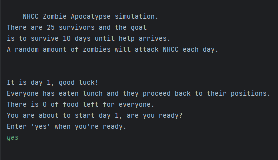
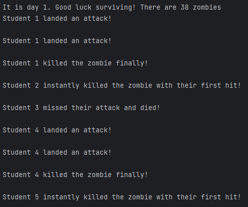
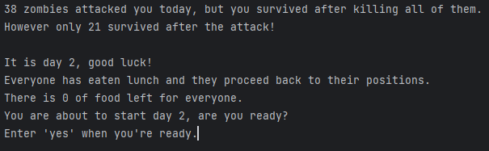

# Zombie Survival Challenge Game

## Description

This Java-based Zombie Survival Challenge Game is an interactive text-based simulation of a zombie apocalypse. Players manage a group of survivors and face daily challenges, including combat scenarios against hordes of zombies. The game offers a thrilling and unpredictable experience, testing your survival skills and decision-making.

## Features

- **Dynamic Gameplay**: Experience varied gameplay scenarios, thanks to comprehensive randomization and probability calculations.
- **Resource Management**: Manage limited resources such as ammo and food to keep your survivors alive.
- **Survivor Combat**: Engage in combat scenarios, where your survivors battle against hordes of zombies.
- **Replayability**: With different outcomes in each playthrough, this game offers high replayability.
- **Victory and Defeat**: Survive for 10 days to achieve victory or face defeat if all survivors perish.
- **Console-Based Interface**: Play the game directly through your console or terminal.

## How to Play

1. Clone this repository to your local machine.
2. Compile and run the `Main.java` file in your Java IDE or via the command line.
3. Follow the on-screen instructions to navigate through the game.
4. Try to keep your survivors alive for 10 days!

## Gameplay Screenshots

## Technologies Used

- Java

## Project Structure

- `Apocalypse.java`: The main game logic.
- `Person.java`: Class defining survivor attributes and actions.
- `Utilities.java`: Utility class with constants, randomization, and game messages.
- `Main.java`: The main class to run the game.

## Acknowledgments

This project was developed by Michael Ha as part of CS2001. Feel free to contribute to this project and make it even more exciting!

## License

This project is licensed under the MIT License - see the [LICENSE](LICENSE) file for details.

---

Enjoy the game and happy surviving!
